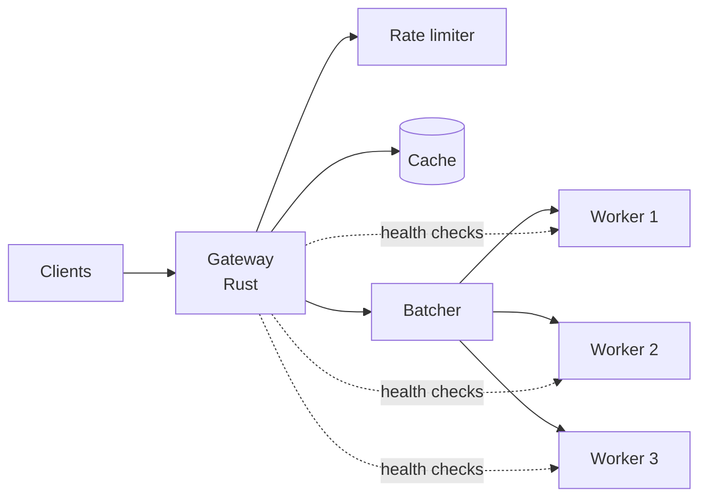

# verdict

Rust serving platform for a from-scratch, calibrated decision model, built and measured in stages to explore system design trade-offs.

> **Status:** In progress: Phase 0 (setup). Nothing below the roadmap is built yet; benchmark tables fill in as milestones complete.

## What it is

Most language models generate text. This one makes **decisions**: you send some input plus a set of declared answer options, and it returns a probability for each option in a single forward pass.

```
"Customer says the payment failed twice and they need it fixed today."
  → billing: 0.87   technical: 0.11   account: 0.02
```

The project has two halves:

1. **The serving system** — a Rust gateway in front of a pool of inference workers, with caching, load balancing, health checks, rate limiting and dynamic batching. Built first against fake workers, then deployed to the cloud.
2. **The model** — a small transformer trained from scratch in Python, pretrained on next-token prediction and then given a decision head that outputs calibrated probabilities. Served from Rust via [`candle`](https://github.com/huggingface/candle) behind the same contract the fake workers use.

Every design decision is measured. The [design doc](docs/DESIGN.md) records what was built, which alternatives were rejected, and the numbers behind each choice.

## Architecture



Workers are interchangeable behind the `/decide` contract:

| Stage | Worker implementation |
| --- | --- |
| Now | Fake worker — simulates single-pass latency that scales with input length and option count |
| Later | Real model — from-scratch transformer with a decision head, served via `candle` |

## The `/decide` contract (draft v0)

This contract stays fixed when workers are swapped, so the gateway never changes.

**Request**

```json
{
  "input": "Customer says the payment failed twice and they need it fixed today.",
  "question": {
    "type": "choice",
    "options": ["billing", "technical", "account"]
  }
}
```

Question types:

| Type | Options | Example |
| --- | --- | --- |
| `choice` | Declared list | Which team should handle this ticket? |
| `yes_no` | Implicit: `yes`, `no` | Is this message urgent? |
| `score` | Integer scale, e.g. 1–5 | How positive is this review? |

**Response**

```json
{
  "type": "choice",
  "probabilities": {
    "billing": 0.87,
    "technical": 0.11,
    "account": 0.02
  },
  "answer": "billing",
  "model": "fake-v0",
  "latency_ms": 212
}
```

## Roadmap

### Phase 1 — Rust foundations
- [ ] Rust Book (core chapters) and Tokio tutorial

### Phase 2 — Local systems project
- [ ] **M1** Gateway forwards to one fake worker; baseline throughput and p50/p99 latency
- [ ] **M2** Response cache with expiry
- [ ] **M3** Three workers, round-robin load balancing, health checks
- [ ] **M4** Token-bucket rate limiter
- [ ] **M5** Containerised with Docker Compose
- [ ] **M6** Dynamic batching
- [ ] Design doc v1

### Phase 3 — Cloud
- [ ] **M7** Single-VM deployment
- [ ] **M8** Gateway and workers split across machines
- [ ] Design doc v2

### Phase 4–5 — The model
- [ ] Pretrain a tiny transformer
- [ ] Decision head and fine-tuning on Choice / Yes-No / Score data
- [ ] Calibration (reliability diagram, expected calibration error, temperature scaling)
- [ ] Serve via `candle` behind `/decide`; re-run all benchmarks

## Results

Filled in as each milestone completes. No numbers appear here until they've been measured.

| Milestone | Metric | Result |
| --- | --- | --- |
| M1 Baseline | Throughput / p50 / p99 | — |
| M2 Cache | p50 at 0% / 50% / 90% hit rate | — |
| M3 Failure | Error rate and recovery time when a worker dies | — |
| M4 Rate limiting | p99 for normal traffic under overload | — |
| M6 Batching | Throughput vs p99 across batch wait times | — |
| M7–M8 Cloud | Local vs single-VM vs multi-machine | — |

## Running locally

_Available from M5. Planned:_

```bash
git clone <repo-url>
cd verdict
docker compose up
```

## Repository layout

```
Cargo.toml      Workspace root
CLAUDE.md       Rules for Claude Code in this repo
gateway/        Rust gateway: routing, cache, rate limiting, batching
worker-fake/    Rust fake worker implementing /decide
docs/           Design doc and diagrams
```

Added when the relevant milestone starts:

```
bench/          Load-test scripts and raw results (M1)
worker-model/   Rust worker serving the trained model via candle (Phase 5)
training/       Python: pretraining, decision head, calibration (Phase 4)
```

## Tech stack

- **Rust** — gateway and inference workers (`tokio`, `axum`, `candle`)
- **Python** — model training (PyTorch)
- **Docker Compose** — local multi-service setup
- **AWS** — cloud deployment

## How this was built

Core logic (request forwarding, caching, rate limiting, batching and model code) is written by hand. [Claude Code](https://claude.com/claude-code) is used for configuration, Dockerfiles, CI, test and benchmark scripts, infrastructure, and code review. The split is enforced in [`CLAUDE.md`](CLAUDE.md).

## License

MIT